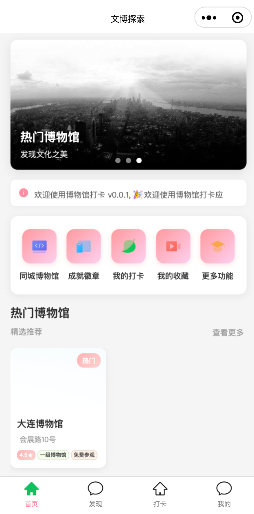
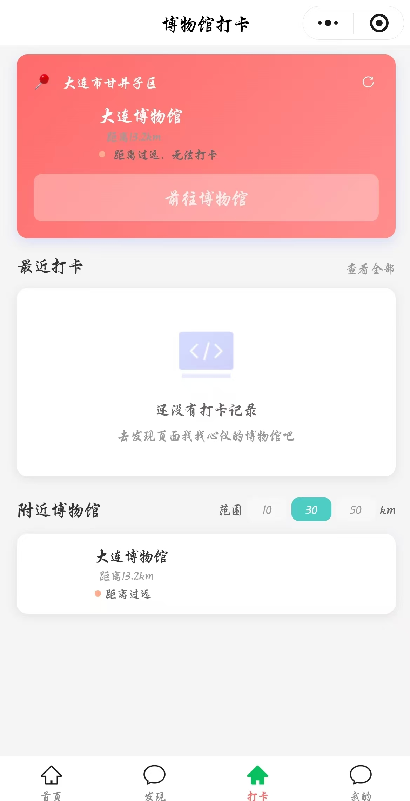

# Mseek-mini 文博探索小程序

<div align="center">


**一款基于地理位置的文化旅游微信小程序**

探索身边的文化宝藏 · 记录每一次博物馆之旅

[](https://developers.weixin.qq.com/miniprogram/dev/framework/)
[](https://www.typescriptlang.org/)
[](./LICENSE)

</div>

---

## 📱 应用展示

<div align="center">
  
  
  
</div>

---

## 📋 项目简介

**MSeek-mini 文博探索小程序** 是一款专注于博物馆文化探索的微信小程序，致力于让用户轻松发现、记录和分享博物馆参观体验。

### ✨ 核心特色

- 🎯 **原生开发**: 基于微信小程序原生框架，性能优异
- 📝 **TypeScript**: 全面使用 TypeScript，代码更可靠
- 🚀 **Skyline 渲染**: 支持 Skyline 渲染引擎，体验更流畅
- 🌐 **真实数据**: 对接后端 API，展示真实博物馆数据
- 📍 **位置服务**: 基于 GPS 的地理位置打卡验证
- 🎨 **现代设计**: 简洁美观的 UI 设计，符合微信设计规范

### 🎯 主要功能

#### 🏠 首页模块
- **轮播推荐**: 展示热门博物馆和精选展览
- **系统公告**: 实时推送活动和系统消息
- **快速入口**: 同城博物馆、成就徽章、我的打卡、我的收藏等
- **热门博物馆**: 展示人气博物馆，支持标签筛选
- **最新展览**: 展示正在进行和即将开始的展览

#### 🔍 发现模块
- **全国博物馆**: 浏览全国范围内的博物馆
- **分类筛选**: 按博物馆类型、等级等维度筛选
- **搜索功能**: 支持博物馆名称关键词搜索
- **排序方式**: 人气、评分、距离等多种排序
- **详情查看**: 查看博物馆详细信息、展览、开放时间等

#### ✅ 打卡模块
- **位置定位**: 自动获取用户当前位置
- **附近博物馆**: 显示指定范围内可打卡的博物馆
- **距离筛选**: 支持 1km、5km、10km 范围选择
- **打卡验证**: 基于 GPS 位置验证是否在博物馆附近
- **照片上传**: 拍照记录参观瞬间
- **打卡历史**: 查看个人打卡记录和统计
- **草稿箱**: 暂存未完成的打卡记录

#### 👤 个人中心
- **用户信息**: 展示用户头像、昵称、积分等
- **我的收藏**: 管理收藏的博物馆
- **打卡历史**: 查看历史打卡记录
- **成就徽章**: 查看已获得的成就
- **积分商城**: 使用积分兑换奖品
- **设置中心**: 个人信息设置、隐私设置等

---

## 🚀 快速开始

### 📦 环境要求

| 工具/环境 | 版本要求 | 说明 |
|---------|---------|------|
| 微信开发者工具 | 最新稳定版 | [下载地址](https://developers.weixin.qq.com/miniprogram/dev/devtools/download.html) |
| Node.js | 16.x 及以上 | 用于安装依赖包 |
| TypeScript | 5.0+ | 已在项目中配置 |

### 🔧 安装步骤

1. **克隆项目**
   ```bash
   git clone https://github.com/zketer/mseek-mini.git
   cd mseek-mini
   ```

2. **安装依赖**
   ```bash
   npm install
   ```

3. **配置后端 API**
   
   编辑 `miniprogram/config/env.ts` 文件，配置后端服务地址：
   ```typescript
   const productionConfig: EnvConfig = {
     apiBaseUrl: 'https://your-api-domain.com',  // 修改为你的后端地址
     timeout: 15000,
     debug: false,
     name: '生产环境'
   }
   ```

4. **打开项目**
   - 启动微信开发者工具
   - 选择"导入项目"
   - 选择项目目录
   - 填写 AppID（测试可使用测试号）

5. **编译运行**
   - 点击工具栏的"编译"按钮
   - 在模拟器中查看效果
   - 使用真机调试测试完整功能

---

## 📁 项目结构

```
mseek-mini/
├── miniprogram/                    # 小程序源代码目录
│   ├── app.ts                     # 应用入口文件
│   ├── app.json                   # 全局配置文件
│   ├── app.wxss                   # 全局样式文件
│   │
│   ├── pages/                     # 页面目录
│   │   ├── index/                # 首页 - 轮播图、公告、热门博物馆、最新展览
│   │   ├── discovery/            # 发现页 - 全国博物馆列表、搜索、筛选
│   │   ├── checkin/              # 打卡页 - 附近博物馆、打卡功能
│   │   ├── profile/              # 个人中心 - 用户信息、收藏、历史
│   │   ├── login/                # 登录页 - 微信授权登录
│   │   ├── museum/               # 博物馆相关页面
│   │   │   ├── detail/          # 博物馆详情
│   │   │   ├── list/            # 博物馆列表
│   │   │   └── nearby/          # 附近博物馆
│   │   ├── exhibition/           # 展览相关页面
│   │   │   ├── detail/          # 展览详情
│   │   │   └── list/            # 展览列表
│   │   ├── user/                 # 用户相关页面
│   │   │   ├── profile/         # 个人资料
│   │   │   ├── favorites/       # 我的收藏
│   │   │   └── history/         # 打卡历史
│   │   ├── achievements/         # 成就徽章页
│   │   ├── checkin-action/       # 打卡操作页
│   │   ├── checkin-detail/       # 打卡详情页
│   │   ├── draft-list/           # 草稿箱
│   │   ├── search/               # 搜索页
│   │   ├── map/                  # 地图页
│   │   ├── settings/             # 设置页
│   │   └── ...                   # 其他页面
│   │
│   ├── services/                  # API 服务层
│   │   ├── auth.ts               # 认证服务 - 登录、登出、token管理
│   │   └── museum.ts             # 博物馆服务 - 博物馆、展览、打卡等API
│   │
│   ├── utils/                     # 工具函数
│   │   ├── http.ts               # HTTP 请求封装
│   │   ├── auth-guard.ts         # 路由守卫 - 登录拦截
│   │   └── util.ts               # 通用工具函数
│   │
│   ├── config/                    # 配置文件
│   │   └── env.ts                # 环境配置 - API地址、超时时间等
│   │
│   ├── components/                # 自定义组件（预留）
│   ├── images/                    # 图片资源
│   ├── icons/                     # 图标资源
│   └── styles/                    # 样式文件（预留）
│
├── typings/                       # TypeScript 类型定义
├── docs/                          # 文档目录（需创建）
│   └── images/                    # README 图片资源
│
├── project.config.json            # 微信小程序项目配置
├── project.miniapp.json           # 多平台配置
├── project.private.config.json    # 私有配置（不提交）
├── tsconfig.json                  # TypeScript 编译配置
├── package.json                   # npm 依赖配置
├── .gitignore                     # Git 忽略文件配置
└── README.md                      # 项目说明文档
```

---

## 🔧 技术栈

### 前端技术

| 技术 | 说明 | 版本 |
|-----|------|------|
| 微信小程序 | 原生小程序框架 | - |
| TypeScript | JavaScript 超集，提供类型检查 | 5.0+ |
| Skyline | 微信新一代渲染引擎 | - |
| WXSS | 微信样式语言 | - |

### 核心能力

- **网络请求**: 基于 `wx.request` 封装的 HTTP 客户端
- **状态管理**: 使用本地存储 + 全局变量
- **路由管理**: 微信小程序原生路由 + 自定义路由守卫
- **权限管理**: 基于 token 的认证机制
- **位置服务**: 微信 GPS 定位 API

---

## ⚙️ 配置说明

### 1. 环境配置

编辑 `miniprogram/config/env.ts`：

```typescript
// 开发环境
const developmentConfig: EnvConfig = {
  apiBaseUrl: 'http://localhost:8000',  // 本地开发服务器
  timeout: 10000,
  debug: true,
  name: '开发环境'
}

// 生产环境
const productionConfig: EnvConfig = {
  apiBaseUrl: 'https://api.your-domain.com',  // 生产服务器
  timeout: 15000,
  debug: false,
  name: '生产环境'
}
```

### 2. 项目配置

`project.config.json` 关键配置项：

```json
{
  "appid": "",                          // 小程序 AppID
  "projectname": "mseek-mini",
  "compileType": "miniprogram",
  "setting": {
    "useCompilerPlugins": ["typescript"],  // 启用 TypeScript
    "skylineRenderEnable": true            // 启用 Skyline 渲染
  },
  "srcMiniprogramRoot": "miniprogram/"
}
```

### 3. 权限配置

在 `app.json` 中已配置位置权限：

```json
{
  "permission": {
    "scope.userLocation": {
      "desc": "你的位置信息将用于为你推荐附近的博物馆"
    }
  },
  "requiredPrivateInfos": ["getLocation"]
}
```

---

## 📝 开发规范

### 命名规范

| 类型 | 规范 | 示例 |
|-----|------|------|
| 页面目录 | 小写短横线分隔 | `museum-detail/` |
| 组件目录 | 小写短横线分隔 | `museum-card/` |
| TypeScript 文件 | 小驼峰命名 | `museumService.ts` |
| 接口定义 | 大驼峰命名 | `interface Museum {}` |
| 常量 | 大写下划线分隔 | `API_BASE_URL` |

### 代码规范

- ✅ 使用 TypeScript 进行类型检查
- ✅ 遵循微信小程序官方开发规范
- ✅ 统一使用 2 空格缩进
- ✅ 使用 async/await 处理异步操作
- ✅ 添加必要的注释和文档
- ✅ 错误处理要完善，避免程序崩溃

### 提交规范

```bash
# 功能开发
git commit -m "feat: 添加博物馆详情页"

# Bug 修复
git commit -m "fix: 修复打卡距离计算错误"

# 文档更新
git commit -m "docs: 更新 README 文档"

# 样式调整
git commit -m "style: 优化首页布局"
```

---

## 🐛 常见问题

### 1. 开发者工具无法打开项目

**问题**: 微信开发者工具提示项目配置错误

**解决方案**:
- 确保已安装最新版微信开发者工具
- 检查 `project.config.json` 配置是否正确
- 确认 `appid` 字段已填写（可使用测试号）

### 2. API 请求失败

**问题**: 网络请求返回 404 或超时

**解决方案**:
- 检查后端服务是否正常启动
- 确认 `miniprogram/config/env.ts` 中的 API 地址正确
- 开发阶段在开发者工具中开启"不校验合法域名"选项
- 生产环境需在微信公众平台配置服务器域名白名单

### 3. 位置权限获取失败

**问题**: 无法获取用户位置信息

**解决方案**:
- 检查 `app.json` 中是否配置了位置权限
- 确保用户已授权位置权限
- 真机调试时检查手机 GPS 是否开启
- 检查微信是否有位置权限

### 4. TypeScript 编译错误

**问题**: 提示类型错误或编译失败

**解决方案**:
- 运行 `npm install` 确保依赖已安装
- 检查 `tsconfig.json` 配置
- 确保使用了正确的类型定义

### 5. 登录功能异常

**问题**: 登录后仍提示未登录

**解决方案**:
- 检查 token 是否正确存储到本地
- 确认后端返回的 token 格式正确
- 查看控制台是否有认证相关错误日志

---

## 📚 相关文档

### 📖 项目文档

- 📘 **开发文档**: 详细的开发指南和最佳实践
- 📗 **API 对接说明**: 后端 API 接口文档
- 📙 **路由守卫使用**: [auth-guard-usage.md](./miniprogram/utils/auth-guard-usage.md)

### 🔗 外部资源

| 资源 | 链接 | 说明 |
|-----|------|------|
| 微信小程序官方文档 | [查看](https://developers.weixin.qq.com/miniprogram/dev/framework/) | 小程序开发指南 |
| TypeScript 文档 | [查看](https://www.typescriptlang.org/docs/) | TypeScript 语法参考 |
| Skyline 渲染引擎 | [查看](https://developers.weixin.qq.com/miniprogram/dev/framework/runtime/skyline/) | 新一代渲染引擎 |
| 微信开发者社区 | [查看](https://developers.weixin.qq.com/community/develop) | 问题讨论和交流 |

---

## 🤝 贡献指南

欢迎贡献代码、提出问题和建议！

### 贡献流程

1. Fork 本仓库
2. 创建特性分支 (`git checkout -b feature/AmazingFeature`)
3. 提交更改 (`git commit -m 'feat: 添加某个功能'`)
4. 推送到分支 (`git push origin feature/AmazingFeature`)
5. 提交 Pull Request

### 问题反馈

- 🐛 **Bug 反馈**: [提交 Issue](https://github.com/zketer/mseek-mini/issues)
- 💡 **功能建议**: [提交 Issue](https://github.com/zketer/mseek-mini/issues)
- 💬 **技术讨论**: [GitHub Discussions](https://github.com/zketer/mseek-mini/discussions)

---

## 👥 开发团队

- **项目维护**: zlynn
- **联系邮箱**: museumseek@163.com
- **GitHub**: [@zketer](https://github.com/zketer)

---

## 📄 开源协议

本项目采用 [Apache License 2.0](./LICENSE) 开源协议

```
Apache License 2.0

Copyright (c) 2024 MSeek Team

Licensed under the Apache License, Version 2.0 (the "License");
you may not use this file except in compliance with the License.
You may obtain a copy of the License at

    http://www.apache.org/licenses/LICENSE-2.0

Unless required by applicable law or agreed to in writing, software
distributed under the License is distributed on an "AS IS" BASIS,
WITHOUT WARRANTIES OR CONDITIONS OF ANY KIND, either express or implied.
See the License for the specific language governing permissions and
limitations under the License.
```

---

## 🌟 致谢

感谢所有为这个项目做出贡献的开发者！

如果这个项目对你有帮助，欢迎 Star ⭐️

---

<div align="center">

**MSeek 博物馆打卡小程序**

探索文化 · 记录足迹 · 分享美好

Made with ❤️ by zlynn

---

**最后更新**: 2025-11-01  
**当前版本**: v.0.01-beta

</div>
